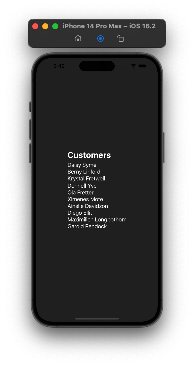

# expo-apollo-sandbox

A playground for testing Apollo with Expo.

<p align="center">
  
</p>

## setup

1. run `yarn`
2. copy/paste `example.env` to `.env` and fill in the values (hasura sample app url and secret)
3. run `yarn start`

## branches (🚧 in progress, 🏁 finished)

```
├── 🏁 `main` Apollo Client with caching
├── 🚧 `mutation-optimistic-ui` Mutation with optomistic UI
├── `offline-support` Offline support
├── `subscriptions` Subscriptions
├── `state-navigation-recovery` State and navigation recovery
└── `mock-server` Mock server
```

## areas to sandbox

- [x] setup apollo client
- [ ] add mutation + optimistic UI ([reactive variables](https://www.apollographql.com/docs/react/local-state/local-state-management#reactive-variables))
- [ ] offline support: "user goes offline, then back online" ([article 1](https://codeburst.io/highly-functional-offline-applications-using-apollo-client-12885bd5f335), [article 2](https://medium.com/twostoryrobot/a-recipe-for-offline-support-in-react-apollo-571ad7e6f7f4))
- [ ] add graphQL subscriptions
- [ ] add state and navigation recovery (user closes the app)
- [ ] add mock server ([msw](https://mswjs.io/docs/getting-started/mocks/graphql-api))
- [ ] add multilingual support ([i18next](https://react.i18next.com/), [Ignite example](https://github.com/infinitered/ignite/blob/b3d5b0db710a75ec349a1eb142f27bdffb3691ad/boilerplate/app/i18n/i18n.ts))
